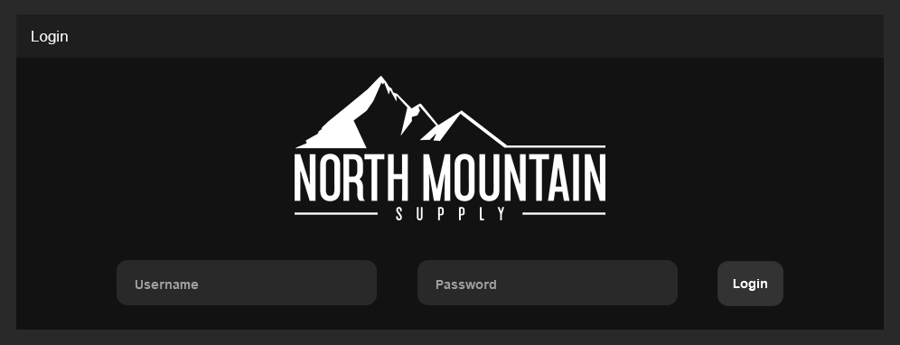
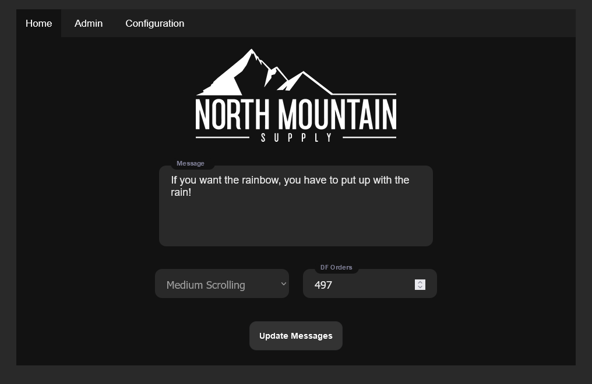
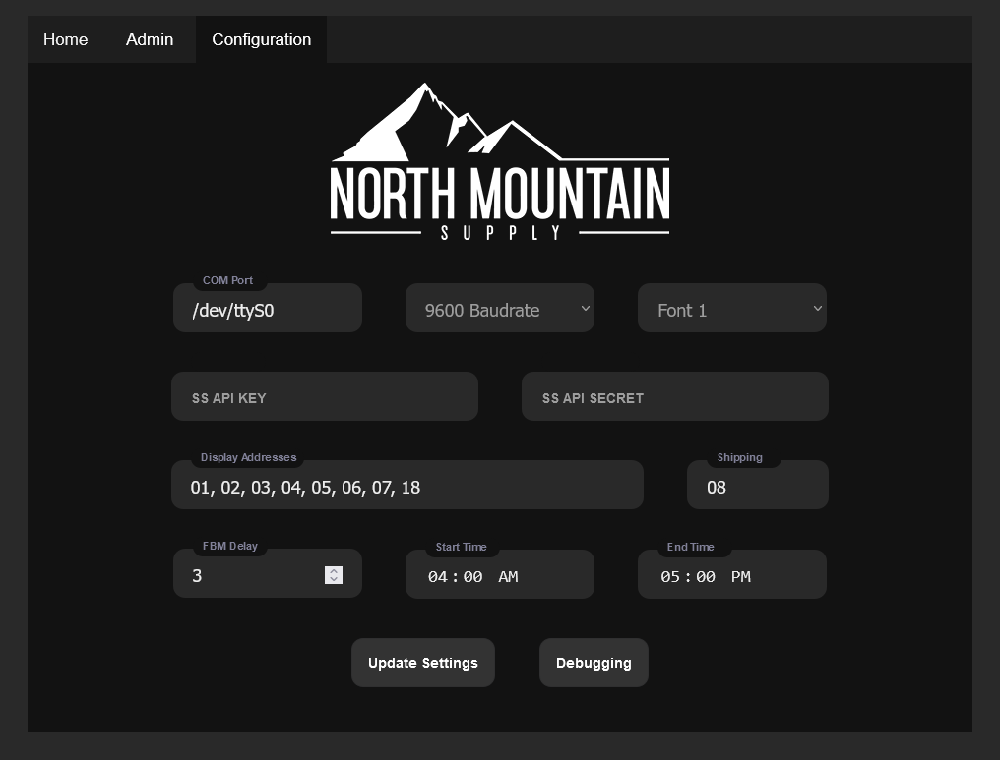
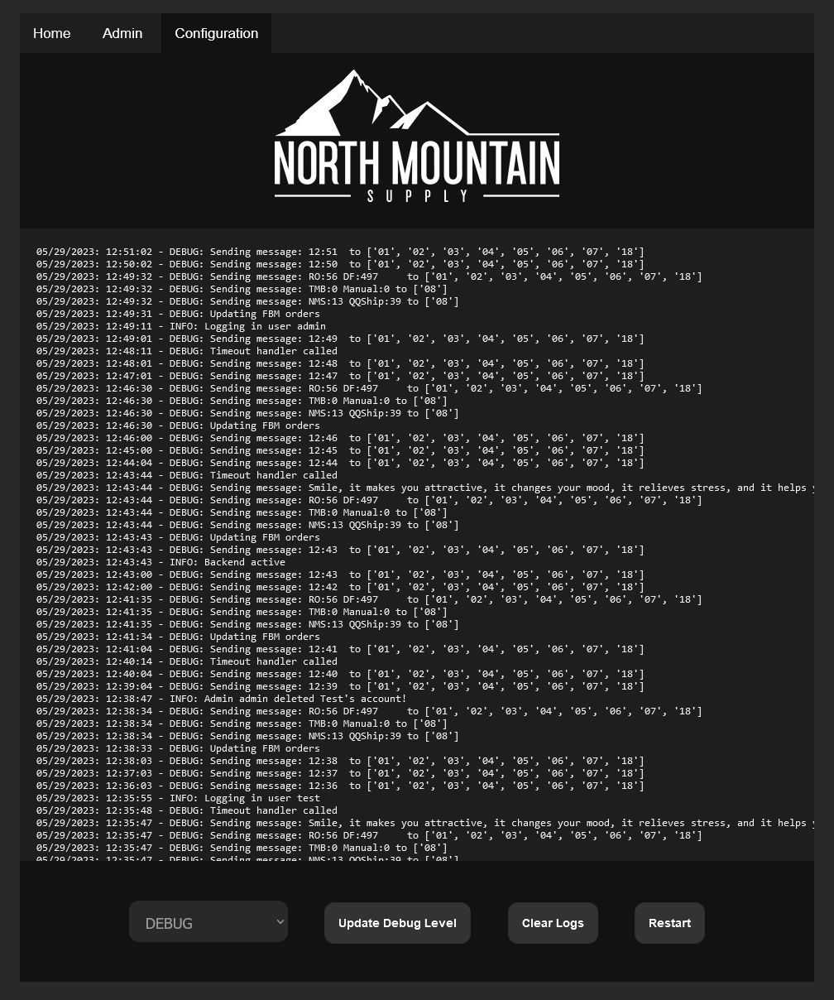
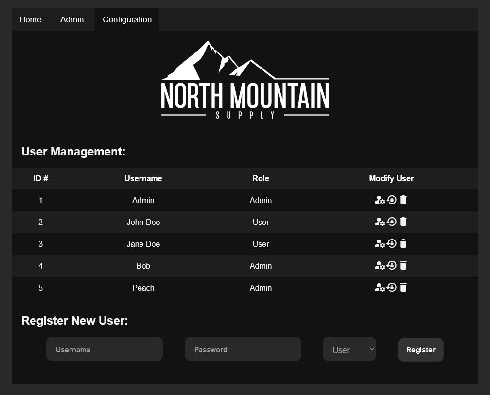

## NMS Display Control Software for Vorne Industries M1000 Displays
*Author: Sylphrena Kleinsasser*

*Developed for [North Mountain Supply, LLC](https://northmountainsupply.com)*

This program uses [Flask](https://flask.palletsprojects.com/en/2.1.x/) to host a web server that controls Vorne M1000 displays over serial. Includes friendly configuration menus, user management, and a module to connect to the [Shipstation API](https://help.shipstation.com/hc/en-us/articles/360025856212-ShipStation-API) to display order data. Uses a [SQLite](https://docs.python.org/3/library/sqlite3.html) database to store userdata, logs, and settings. Allows users to set power timeout to conserve power at night.

**Dependancies (that aren't included):**
 - python: [Flask](https://flask.palletsprojects.com/en/2.1.x/installation)
 - python: [schedule](https://schedule.readthedocs.io/en/stable/installation.html)
 - python: [pyserial](https://pyserial.readthedocs.io/en/latest/pyserial.html#installation)

Install by running the command `pip3 install flask schedule pyserial` in your terminal.

## **Screenshots:** 
 

Login Page 

 

Display Control Page 

 

User Settings Page 

 

Configuration Page 

 

Debugging Page

 

User Management Page