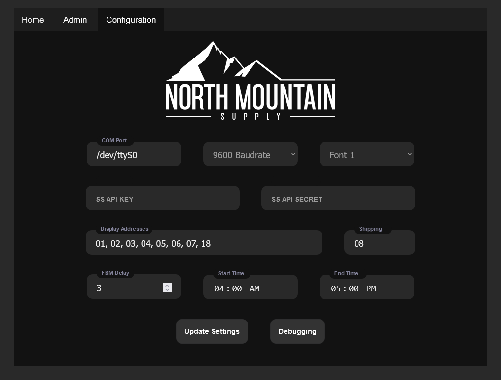

# NMS Display Control Software for Vorne Industries M1000 Displays

## Author: Sylphrena Kleinsasser

*Developed for [North Mountain Supply, LLC](https://northmountainsupply.com)*

To deploy this product, start by installing the a desired number of Vorne Industries M1000 Series Serial Displays. You will need to wire power and connect all displays to a computer running this software. Setup the displays using the documentation in [the manual](../m1000-manual.pdf) with RS-232 connectors. You'll probably want to create your own cables and buy an DB9 serial connector to interface with your computer. You can also use a USB to Serial adapter if your computer does not have a serial port, though this can be finicky. Ensure you also set each display to the same baud rate and parity settings, but a different address for each display (see the manual page 5 for details).

Next, you'll want to prepare your server. If you need the host computer for other services, consider using something like [proxmox](https://www.proxmox.com/en/proxmox-ve) or [docker](https://www.docker.com/) to containerize the software. This software has not been tested with docker, so proceed at your own risk if you choose that route. Install a linux distro of your choice. This software was tested on Lubuntu 21.04, but the latest headless Debian or Ubuntu distro is recommended.

Install python dependencies with `pip3 install flask schedule pyserial`. You may need to install pip3 with `apt install python3-pip`, or python3 with `apt install python3`. This software was tested with python 3.9.5. Install git with `apt install git`. Clone this repository to your server with `git clone https//github.com/sylphrena/vorne-display-control`.

Create a systemd service to run the software on boot. Create a file at `/etc/systemd/system/vorne-display-control.service` with the following contents (replace /nms/ with your username):

```bash
[Unit]
Description=NMS M1000 Display Control

[Service]
User=root
WorkingDirectory=/home/nms/Documents/vorne-display-control/
ExecStart=/home/nms/Documents/vorne-display-control/start.sh
StartLimitIntervalSec=5
StartLimitBurst=5
Restart=always

[Install]
WantedBy=multi-user.target
```

Initialize the database with the following command: `export FLASK_APP=application;export FLASK_ENV=development;flask init-db`.

Enable the service with `systemctl enable vorne-display-control.service`. Start the service with `systemctl start vorne-display-control.service`. Check the status of the service with `systemctl status vorne-display-control.service`. If the service is not running, check the logs with `journalctl -u vorne-display-control.service`.

Assuming you have configured everything correctly, the service should be running. You can access the web interface at `http://localhost:80` or `http://<ip address>:80` if you are accessing the server remotely. The default username/password is Admin/administrator. Once you login, configure your display settings on the configuration page and change the default password on the user settings page.

When the service starts, it runs [start.sh](../start.sh). To modify the web application port, ip address, or to disable the debugger (recommended if untrusted users may have access to the web interface), modify the `start.sh` file.



You'll need to set the COM port to the communications port of your serial port on your computer, and match the baud rate setting to the baud rate of your displays. The parity setting on your display(s) is assumed to be 8 bits. You can change the font of messages using the dropdown, each font is documented in the [display manual](../m1000-manual.pdf).

Set the Shipstation API key and secret to enable the shipping display. If you do not wish to set the API key and secret, you'll want to modify `updateFBM()` in [backend.py](../application/backend.py), as this will fill the logs with errors. You'll want to modify this anyway, as the shipstation store IDs for NMS are hardcoded in this function.

Use a comma separated list to define the display addresses and define the shipping address. You may only define one shipping address.

You can modify the FBM delay, this is the time in minutes between each shipstation API call. The default is 3 minutes. You may also edit the start/end times to define the time window in which the displays will be active, to conserve energy outside of business hours.